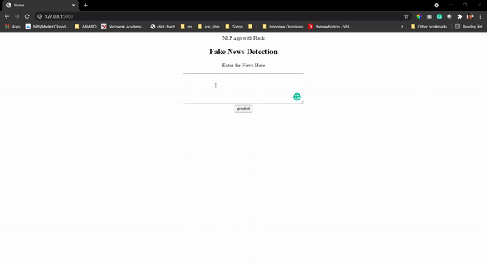

# Fake-News-Detection-end-to-end

## Problem Statement
To detect whether the news is fake or not by using **Recurrent Neural Networks** and **NLP**

## Dataset 
This dataset contains csv file containing 20800 news with the label of True or Fake

The dataset can be found from (https://www.kaggle.com/c/fake-news)

## Image Preprocessing
The News are not in machine understanding format and to convert the data to machine understandable code I have performed certain NLP processes such as 

1.  Lower case convertion
2.  Removing the numbers, special characters and stopwords.
3.  Tokenization

## Model Building, Training and Prediciton :
* Here a basic model is built using RNN, NLP and Keras library.
* Model is first trained using Neural Networks and then model is tested on sample test data. I have tried on different model and whichever model is giving the good accuracy that model is saved for further use. Using the Test data the prediction is performed.

One front-end page is created for the model and can be used for prediction of new news.

Reload the page to see the below gif.

